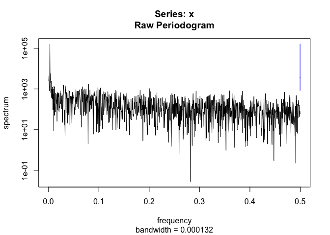
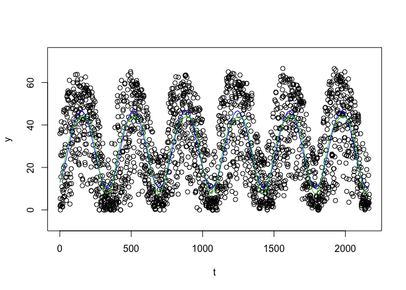
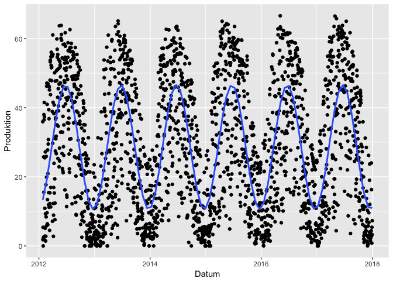
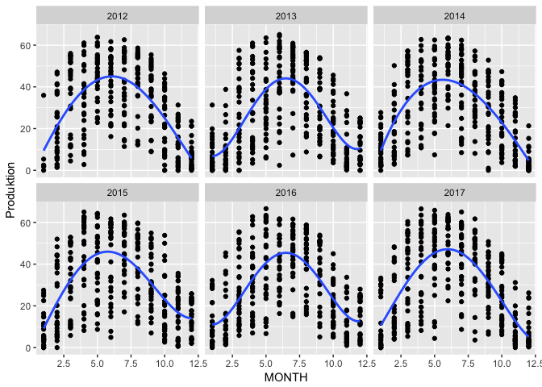
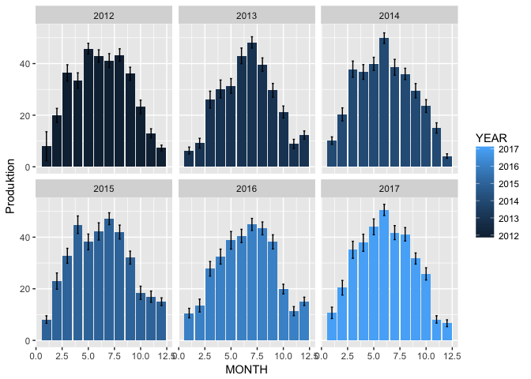
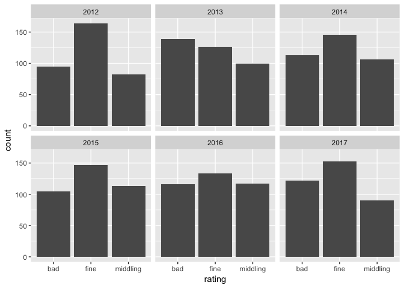
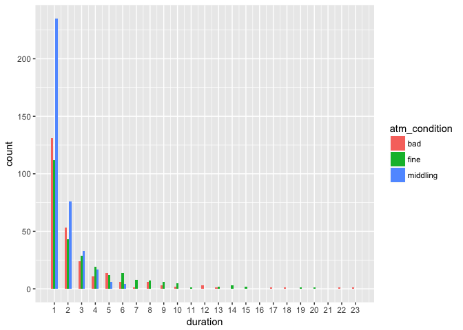
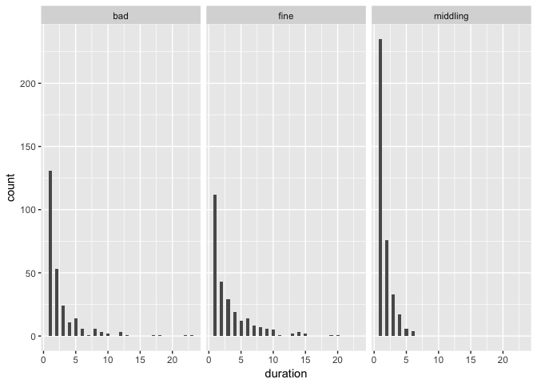
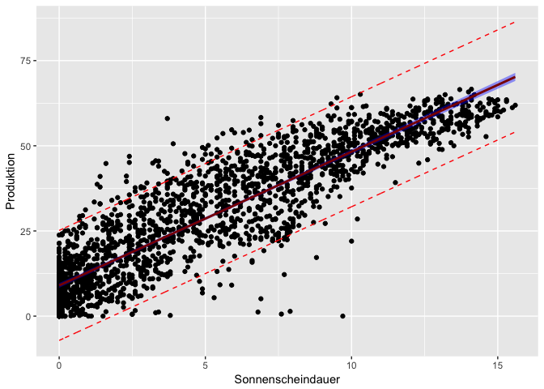
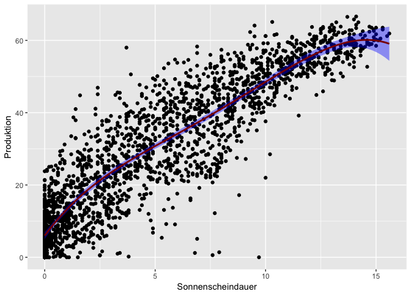

Solar cell data analysis
================

Analysis of solar cell production
=================================

Over the last 6 years I recorded the daily production of out roof mounted solar panels. The panels have a peak production of 10kw/p

Setup
-----

Read data
---------

Data were recorded daily and put in a spreadsheet. For every year a seperate spreadsheet was used. Data were then exported in csv-format, read into R and compined into one tible.

First processing
----------------

### Add standard deviation and mean

``` r
solarcell_tbl_avg <- summarySE(solarcell_tbl, measurevar="Produktion", groupvars=c("YEAR","MONTH"))
```

    ## -------------------------------------------------------------------------

    ## You have loaded plyr after dplyr - this is likely to cause problems.
    ## If you need functions from both plyr and dplyr, please load plyr first, then dplyr:
    ## library(plyr); library(dplyr)

    ## -------------------------------------------------------------------------

    ## 
    ## Attaching package: 'plyr'

    ## The following object is masked from 'package:lubridate':
    ## 
    ##     here

    ## The following objects are masked from 'package:dplyr':
    ## 
    ##     arrange, count, desc, failwith, id, mutate, rename, summarise,
    ##     summarize

``` r
#summary over for months
solarcell_tbl_avg %>% 
  group_by( MONTH) %>% 
  summarise_at(vars(Produktion), funs(mean,sd))
```

    ## # A tibble: 12 x 3
    ##    MONTH  mean    sd
    ##    <dbl> <dbl> <dbl>
    ##  1    1.  8.95  1.78
    ##  2    2. 17.7   5.25
    ##  3    3. 32.6   4.78
    ##  4    4. 35.9   5.19
    ##  5    5. 39.7   5.08
    ##  6    6. 44.8   4.26
    ##  7    7. 43.6   3.75
    ##  8    8. 40.9   2.80
    ##  9    9. 32.9   3.53
    ## 10   10. 22.0   2.67
    ## 11   11. 12.2   3.46
    ## 12   12. 10.1   4.68

``` r
#summary over for year
solarcell_tbl_avg %>% 
  group_by(YEAR) %>% 
  summarise_at(vars(Produktion), funs(mean,sd))
```

    ## # A tibble: 6 x 3
    ##    YEAR  mean    sd
    ##   <dbl> <dbl> <dbl>
    ## 1 2012.  29.2  14.3
    ## 2 2013.  25.5  14.1
    ## 3 2014.  28.5  13.8
    ## 4 2015.  30.1  13.3
    ## 5 2016.  28.0  13.3
    ## 6 2017.  29.5  15.0

``` r
#total produktion
solarcell_tbl %>% 
  group_by(YEAR) %>% 
  summarise_at(vars(Produktion), funs(sum, mean,sd))
```

    ## # A tibble: 6 x 4
    ##    YEAR    sum  mean    sd
    ##   <dbl>  <dbl> <dbl> <dbl>
    ## 1 2012. 10499.  30.8  18.6
    ## 2 2013.  9341.  25.6  19.2
    ## 3 2014. 10396.  28.5  18.6
    ## 4 2015. 10976.  30.1  19.2
    ## 5 2016. 10280.  28.1  18.5
    ## 6 2017. 10776.  29.5  19.9

### Add classification

Any daily production exceeding 40 kW is considered a fine day, between 20 and 40 kW middling, and anything below is considered a bad day.

``` r
solarcell_tbl$rating <- sapply(solarcell_tbl$Produktion, wetter)
```

``` r
y <- solarcell_tbl$Produktion
t <- 1:nrow(solarcell_tbl)
x <- solarcell_tbl$Datum


# sinus fit 
#1
ssp <- spectrum(y) 
```



``` r
per <- 1/ssp$freq[ssp$spec==max(ssp$spec)]
reslm <- lm(y ~ sin(2*pi/per*t)+cos(2*pi/per*t))
summary(reslm)
```

    ## 
    ## Call:
    ## lm(formula = y ~ sin(2 * pi/per * t) + cos(2 * pi/per * t))
    ## 
    ## Residuals:
    ##     Min      1Q  Median      3Q     Max 
    ## -42.835 -10.451  -0.814  11.961  31.383 
    ## 
    ## Coefficients:
    ##                     Estimate Std. Error t value Pr(>|t|)    
    ## (Intercept)          28.5809     0.3062   93.34   <2e-16 ***
    ## sin(2 * pi/per * t)   9.2446     0.4312   21.44   <2e-16 ***
    ## cos(2 * pi/per * t) -15.4222     0.4349  -35.46   <2e-16 ***
    ## ---
    ## Signif. codes:  0 '***' 0.001 '**' 0.01 '*' 0.05 '.' 0.1 ' ' 1
    ## 
    ## Residual standard error: 14.25 on 2164 degrees of freedom
    ## Multiple R-squared:  0.4418, Adjusted R-squared:  0.4413 
    ## F-statistic: 856.3 on 2 and 2164 DF,  p-value: < 2.2e-16

``` r
rg <- diff(range(y))
plot(y~t,ylim=c(min(y)-0.1*rg,max(y)+0.1*rg))
lines(fitted(reslm)~t,col=4,lty=1)   # dashed blue line is sin fit

# including 2nd harmonic really improves the fit
reslm2 <- lm(y ~ sin(2*pi/per*t)+cos(2*pi/per*t)+sin(4*pi/per*t)+cos(4*pi/per*t))
summary(reslm2)
```

    ## 
    ## Call:
    ## lm(formula = y ~ sin(2 * pi/per * t) + cos(2 * pi/per * t) + 
    ##     sin(4 * pi/per * t) + cos(4 * pi/per * t))
    ## 
    ## Residuals:
    ##     Min      1Q  Median      3Q     Max 
    ## -40.248  -9.935  -0.776  12.240  28.724 
    ## 
    ## Coefficients:
    ##                     Estimate Std. Error t value Pr(>|t|)    
    ## (Intercept)          28.5667     0.3031  94.264  < 2e-16 ***
    ## sin(2 * pi/per * t)   9.2501     0.4267  21.679  < 2e-16 ***
    ## cos(2 * pi/per * t) -15.4499     0.4305 -35.892  < 2e-16 ***
    ## sin(4 * pi/per * t)   2.8868     0.4271   6.759 1.78e-11 ***
    ## cos(4 * pi/per * t)  -0.6422     0.4301  -1.493    0.136    
    ## ---
    ## Signif. codes:  0 '***' 0.001 '**' 0.01 '*' 0.05 '.' 0.1 ' ' 1
    ## 
    ## Residual standard error: 14.1 on 2162 degrees of freedom
    ## Multiple R-squared:  0.4539, Adjusted R-squared:  0.4529 
    ## F-statistic: 449.2 on 4 and 2162 DF,  p-value: < 2.2e-16

``` r
lines(fitted(reslm2)~t,col=3) 
```



``` r
#2 fft
raw.fft = fft(y)
```

First Plot
----------

### Scatter plot with sinus fit

 \#\#\# Add classification variables for year, month and day

``` r
solarcell_tbl$YEAR <- year(solarcell_tbl$Datum)
solarcell_tbl$MONTH <- month(solarcell_tbl$Datum)
solarcell_tbl$DAY <- day(solarcell_tbl$Datum)
```

### Scatter plot by year

 \#\#\# Monthly averages plot



### Plot months in a row

``` r
xx <-1:nrow(solarcell_tbl_avg)

ggplot(data = solarcell_tbl_avg, aes(x=xx, y = Produktion )) + geom_bar( stat="identity", width = 0.5)
```


And now for the weather
-----------------------

How many days with fine weather do we have here in Stuttgart

    ## Warning: Ignoring unknown parameters: binwidth, bins, pad



Atmospheric conditions
----------------------

The question was how many days the weather here stays constant, i.e. how many days of fine weather do we have in series. As it turns out, we have a weather here, which changes quite often. Suprise ;(

``` r
atmospheric_conditions_df <- atm_condition_fn(solarcell_tbl, "rating")
atmospheric_conditions_df$atm_condition <- factor(atmospheric_conditions_df$atm_condition)
ggplot(data = atmospheric_conditions_df, aes(x=duration, fill = atm_condition)) + geom_histogram(binwidth=.5, position = "dodge") +
  scale_x_continuous(breaks = round(seq(min(atmospheric_conditions_df$duration), max(atmospheric_conditions_df$duration), by = 1),1)) 
```



``` r
ggplot(data = atmospheric_conditions_df, aes(x=duration)) + geom_histogram(binwidth=.5, position = "identity") +
  facet_wrap(~atm_condition)
```



``` r
  scale_x_continuous(breaks = round(seq(min(atmospheric_conditions_df$duration), max(atmospheric_conditions_df$duration), by = 1),1)) 
```

    ## <ScaleContinuousPosition>
    ##  Range:  
    ##  Limits:    0 --    1

Read DWD Weather Data from Stuttgart Airport
--------------------------------------------

The data can be obtained from: "<https://www.dwd.de/DE/leistungen/weste/westexl/weste_xl.html>". You need to register, which can be done at no charge. I have chosen 'sun shine duration', 'top windspeed' and 'mean temperature'. The data are on a per day basis.

``` r
weather_data <- read_csv2(file = "weste_product_2018_03_10__09_21_28/weste_product_2018_03_10__09_21_27.csv")
```

    ## Using ',' as decimal and '.' as grouping mark. Use read_delim() for more control.

    ## Warning: Missing column names filled in: 'X12' [12]

    ## Parsed with column specification:
    ## cols(
    ##   Element = col_character(),
    ##   Messstation = col_character(),
    ##   Datum = col_date(format = ""),
    ##   Wert = col_double(),
    ##   Einheit = col_character(),
    ##   `Geo-Breite (Grad)` = col_double(),
    ##   `Geo-Länge (Grad)` = col_double(),
    ##   `Höhe (m)` = col_integer(),
    ##   `Sensorhöhe (m)` = col_character(),
    ##   Erstellungsdatum = col_date(format = ""),
    ##   Copyright = col_character(),
    ##   X12 = col_character()
    ## )

``` r
weather_data$Datum <- parse_date_time(weather_data$Datum, "ymd")
str(weather_data)
```

    ## Classes 'tbl_df', 'tbl' and 'data.frame':    6769 obs. of  12 variables:
    ##  $ Element          : chr  "Sonnenscheindauer" "Sonnenscheindauer" "Sonnenscheindauer" "Sonnenscheindauer" ...
    ##  $ Messstation      : chr  "Stuttgart-Echterdingen" "Stuttgart-Echterdingen" "Stuttgart-Echterdingen" "Stuttgart-Echterdingen" ...
    ##  $ Datum            : POSIXct, format: "2012-01-01" "2012-01-02" ...
    ##  $ Wert             : num  0.1 0 4.6 0.4 0.2 1.2 0 0.6 0 1 ...
    ##  $ Einheit          : chr  "hour" "hour" "hour" "hour" ...
    ##  $ Geo-Breite (Grad): num  48.7 48.7 48.7 48.7 48.7 ...
    ##  $ Geo-Länge (Grad) : num  9.22 9.22 9.22 9.22 9.22 ...
    ##  $ Höhe (m)         : int  371 371 371 371 371 371 371 371 371 371 ...
    ##  $ Sensorhöhe (m)   : chr  "keine Daten vorhanden" "keine Daten vorhanden" "keine Daten vorhanden" "keine Daten vorhanden" ...
    ##  $ Erstellungsdatum : Date, format: "2018-03-10" "2018-03-10" ...
    ##  $ Copyright        : chr  "© Deutscher Wetterdienst 2018" "© Deutscher Wetterdienst 2018" "© Deutscher Wetterdienst 2018" "© Deutscher Wetterdienst 2018" ...
    ##  $ X12              : chr  NA NA NA NA ...
    ##  - attr(*, "spec")=List of 2
    ##   ..$ cols   :List of 12
    ##   .. ..$ Element          : list()
    ##   .. .. ..- attr(*, "class")= chr  "collector_character" "collector"
    ##   .. ..$ Messstation      : list()
    ##   .. .. ..- attr(*, "class")= chr  "collector_character" "collector"
    ##   .. ..$ Datum            :List of 1
    ##   .. .. ..$ format: chr ""
    ##   .. .. ..- attr(*, "class")= chr  "collector_date" "collector"
    ##   .. ..$ Wert             : list()
    ##   .. .. ..- attr(*, "class")= chr  "collector_double" "collector"
    ##   .. ..$ Einheit          : list()
    ##   .. .. ..- attr(*, "class")= chr  "collector_character" "collector"
    ##   .. ..$ Geo-Breite (Grad): list()
    ##   .. .. ..- attr(*, "class")= chr  "collector_double" "collector"
    ##   .. ..$ Geo-Länge (Grad) : list()
    ##   .. .. ..- attr(*, "class")= chr  "collector_double" "collector"
    ##   .. ..$ Höhe (m)         : list()
    ##   .. .. ..- attr(*, "class")= chr  "collector_integer" "collector"
    ##   .. ..$ Sensorhöhe (m)   : list()
    ##   .. .. ..- attr(*, "class")= chr  "collector_character" "collector"
    ##   .. ..$ Erstellungsdatum :List of 1
    ##   .. .. ..$ format: chr ""
    ##   .. .. ..- attr(*, "class")= chr  "collector_date" "collector"
    ##   .. ..$ Copyright        : list()
    ##   .. .. ..- attr(*, "class")= chr  "collector_character" "collector"
    ##   .. ..$ X12              : list()
    ##   .. .. ..- attr(*, "class")= chr  "collector_character" "collector"
    ##   ..$ default: list()
    ##   .. ..- attr(*, "class")= chr  "collector_guess" "collector"
    ##   ..- attr(*, "class")= chr "col_spec"

### tidy the waether\_data

as stated in "<http://tidyr.tidyverse.org>" The goal of tidyr is to help you create tidy data. Tidy data is data where:

-   Each variable is in a column.
-   Each observation is a row.
-   Each value is a cell. But in the weather\_data from 'weste-xl' in the column 'Element' are 3 levels, representing 3 different measurement variables (sun shine duraration wind speed and temperature)

``` r
tmp <- weather_data[c("Datum", "Element", "Wert")]
temp2 <- tidyr::spread(tmp, key = Element, value = Wert)
temp2$Datum <- ymd(temp2$Datum)
solarcell_tbl <- inner_join(solarcell_tbl, temp2)
```

    ## Joining, by = "Datum"

Predict daily power production from sun shine duration
------------------------------------------------------

``` r
fit_sonne_prod <- lm(solarcell_tbl$Produktion ~ solarcell_tbl$Sonnenscheindauer)
prd <- predict(fit_sonne_prod, interval="prediction")
```

    ## Warning in predict.lm(fit_sonne_prod, interval = "prediction"): predictions on current data refer to _future_ responses

``` r
solarcell_tbl_fit <- cbind(solarcell_tbl, prd)

ggplot(data = solarcell_tbl_fit, aes(x = Sonnenscheindauer, y = Produktion)) + 
  geom_point() +
  geom_line(aes(y=lwr), color = "red", linetype = "dashed") +
  geom_line(aes(y=upr), color = "red", linetype = "dashed") +
  geom_smooth(method=lm, level=0.99, se=TRUE, color="darkred", fill="blue") 
```



``` r
#summary(fit_sonne_prod)fit_sonne_prod$coefficients
summary(fit_sonne_prod)
```

    ## 
    ## Call:
    ## lm(formula = solarcell_tbl$Produktion ~ solarcell_tbl$Sonnenscheindauer)
    ## 
    ## Residuals:
    ##     Min      1Q  Median      3Q     Max 
    ## -47.067  -5.787  -0.580   4.939  34.476 
    ## 
    ## Coefficients:
    ##                                 Estimate Std. Error t value Pr(>|t|)    
    ## (Intercept)                      9.00652    0.26892   33.49   <2e-16 ***
    ## solarcell_tbl$Sonnenscheindauer  3.92376    0.04031   97.33   <2e-16 ***
    ## ---
    ## Signif. codes:  0 '***' 0.001 '**' 0.01 '*' 0.05 '.' 0.1 ' ' 1
    ## 
    ## Residual standard error: 8.226 on 2165 degrees of freedom
    ## Multiple R-squared:  0.814,  Adjusted R-squared:  0.8139 
    ## F-statistic:  9473 on 1 and 2165 DF,  p-value: < 2.2e-16

``` r
fit_sonne_prod4 <- lm(solarcell_tbl$Produktion ~ poly(solarcell_tbl$Sonnenscheindauer, 4, raw =T), data = solarcell_tbl)
prd4 <- predict(fit_sonne_prod4, interval="prediction")
```

    ## Warning in predict.lm(fit_sonne_prod4, interval = "prediction"): predictions on current data refer to _future_ responses

``` r
solarcell_tbl_fit4 <- cbind(solarcell_tbl, prd)
ggplot(data = solarcell_tbl_fit4, aes(x = Sonnenscheindauer, y = Produktion)) + 
  geom_point() + 
  geom_smooth(se=TRUE, method="lm", formula = y ~ poly(x, 4, raw =T), color="darkred", fill="blue", level =0.99)
```



### Use wind and temperatur to get better predictions

### using a linear model

``` r
fit_sonne_prod_multi <- lm(solarcell_tbl$Produktion ~ solarcell_tbl$Sonnenscheindauer +  solarcell_tbl$`Lufttemperatur Tagesmittel` + solarcell_tbl$Windspitze)
summary(fit_sonne_prod_multi)
```

    ## 
    ## Call:
    ## lm(formula = solarcell_tbl$Produktion ~ solarcell_tbl$Sonnenscheindauer + 
    ##     solarcell_tbl$`Lufttemperatur Tagesmittel` + solarcell_tbl$Windspitze)
    ## 
    ## Residuals:
    ##     Min      1Q  Median      3Q     Max 
    ## -48.528  -5.278  -0.826   4.648  28.959 
    ## 
    ## Coefficients:
    ##                                            Estimate Std. Error t value
    ## (Intercept)                                 5.56162    0.45160  12.315
    ## solarcell_tbl$Sonnenscheindauer             3.44355    0.04246  81.106
    ## solarcell_tbl$`Lufttemperatur Tagesmittel`  0.57007    0.02533  22.503
    ## solarcell_tbl$Windspitze                   -0.01095    0.04266  -0.257
    ##                                            Pr(>|t|)    
    ## (Intercept)                                  <2e-16 ***
    ## solarcell_tbl$Sonnenscheindauer              <2e-16 ***
    ## solarcell_tbl$`Lufttemperatur Tagesmittel`   <2e-16 ***
    ## solarcell_tbl$Windspitze                      0.797    
    ## ---
    ## Signif. codes:  0 '***' 0.001 '**' 0.01 '*' 0.05 '.' 0.1 ' ' 1
    ## 
    ## Residual standard error: 7.365 on 2158 degrees of freedom
    ##   (5 observations deleted due to missingness)
    ## Multiple R-squared:  0.8507, Adjusted R-squared:  0.8505 
    ## F-statistic:  4100 on 3 and 2158 DF,  p-value: < 2.2e-16

``` r
vif(fit_sonne_prod_multi)
```

    ##            solarcell_tbl$Sonnenscheindauer 
    ##                                   1.374828 
    ## solarcell_tbl$`Lufttemperatur Tagesmittel` 
    ##                                   1.411425 
    ##                   solarcell_tbl$Windspitze 
    ##                                   1.063149

### Check for wind chill effect on hot days

You can see that Wind has no discrenible effect on the production of the solar cells, but temperature clearly has. The variance inflation factors calculated by vif() show that variable are uncorrelated from each other. To see if there is a wind chilling effect we would have to compare the power production on days with high sun duration and low wind with days with high sun duration and low wind speeds. One Idea would be, to only look for days with hight temperature, where wind chill would have a discernable effect, but this is still not the case.

``` r
filter_sonne_prod_multi <- solarcell_tbl %>% filter(`Lufttemperatur Tagesmittel` >= 18)
fit_filter_sonne_prod_multi <- lm(filter_sonne_prod_multi$Produktion ~ filter_sonne_prod_multi$Sonnenscheindauer +  filter_sonne_prod_multi$`Lufttemperatur Tagesmittel` + filter_sonne_prod_multi$Windspitze)
summary(fit_filter_sonne_prod_multi)
```

    ## 
    ## Call:
    ## lm(formula = filter_sonne_prod_multi$Produktion ~ filter_sonne_prod_multi$Sonnenscheindauer + 
    ##     filter_sonne_prod_multi$`Lufttemperatur Tagesmittel` + filter_sonne_prod_multi$Windspitze)
    ## 
    ## Residuals:
    ##      Min       1Q   Median       3Q      Max 
    ## -27.7824  -3.1407  -0.2803   3.3815  23.7594 
    ## 
    ## Coefficients:
    ##                                                      Estimate Std. Error
    ## (Intercept)                                          31.39154    2.69873
    ## filter_sonne_prod_multi$Sonnenscheindauer             2.59395    0.08523
    ## filter_sonne_prod_multi$`Lufttemperatur Tagesmittel` -0.39172    0.13542
    ## filter_sonne_prod_multi$Windspitze                    0.04087    0.08271
    ##                                                      t value Pr(>|t|)    
    ## (Intercept)                                           11.632  < 2e-16 ***
    ## filter_sonne_prod_multi$Sonnenscheindauer             30.436  < 2e-16 ***
    ## filter_sonne_prod_multi$`Lufttemperatur Tagesmittel`  -2.893  0.00404 ** 
    ## filter_sonne_prod_multi$Windspitze                     0.494  0.62148    
    ## ---
    ## Signif. codes:  0 '***' 0.001 '**' 0.01 '*' 0.05 '.' 0.1 ' ' 1
    ## 
    ## Residual standard error: 5.787 on 388 degrees of freedom
    ##   (2 observations deleted due to missingness)
    ## Multiple R-squared:  0.7357, Adjusted R-squared:  0.7337 
    ## F-statistic:   360 on 3 and 388 DF,  p-value: < 2.2e-16

``` r
vif(fit_filter_sonne_prod_multi)
```

    ##            filter_sonne_prod_multi$Sonnenscheindauer 
    ##                                             1.253977 
    ## filter_sonne_prod_multi$`Lufttemperatur Tagesmittel` 
    ##                                             1.204914 
    ##                   filter_sonne_prod_multi$Windspitze 
    ##                                             1.065019

### using a polynomial model

``` r
fit_sonne_prod_polym <- lm(solarcell_tbl$Produktion ~ polym( solarcell_tbl$Sonnenscheindauer, solarcell_tbl$`Lufttemperatur Tagesmittel`,solarcell_tbl$Windspitze, degree = 2, raw=TRUE))
summary(fit_sonne_prod_polym)
```

    ## 
    ## Call:
    ## lm(formula = solarcell_tbl$Produktion ~ polym(solarcell_tbl$Sonnenscheindauer, 
    ##     solarcell_tbl$`Lufttemperatur Tagesmittel`, solarcell_tbl$Windspitze, 
    ##     degree = 2, raw = TRUE))
    ## 
    ## Residuals:
    ##     Min      1Q  Median      3Q     Max 
    ## -48.905  -4.176  -0.349   4.166  30.225 
    ## 
    ## Coefficients:
    ##                                                                                                                                            Estimate
    ## (Intercept)                                                                                                                               -0.673669
    ## polym(solarcell_tbl$Sonnenscheindauer, solarcell_tbl$`Lufttemperatur Tagesmittel`, solarcell_tbl$Windspitze, degree = 2, raw = TRUE)1.0.0  4.545663
    ## polym(solarcell_tbl$Sonnenscheindauer, solarcell_tbl$`Lufttemperatur Tagesmittel`, solarcell_tbl$Windspitze, degree = 2, raw = TRUE)2.0.0 -0.072892
    ## polym(solarcell_tbl$Sonnenscheindauer, solarcell_tbl$`Lufttemperatur Tagesmittel`, solarcell_tbl$Windspitze, degree = 2, raw = TRUE)0.1.0  1.101115
    ## polym(solarcell_tbl$Sonnenscheindauer, solarcell_tbl$`Lufttemperatur Tagesmittel`, solarcell_tbl$Windspitze, degree = 2, raw = TRUE)1.1.0 -0.045024
    ## polym(solarcell_tbl$Sonnenscheindauer, solarcell_tbl$`Lufttemperatur Tagesmittel`, solarcell_tbl$Windspitze, degree = 2, raw = TRUE)0.2.0 -0.011641
    ## polym(solarcell_tbl$Sonnenscheindauer, solarcell_tbl$`Lufttemperatur Tagesmittel`, solarcell_tbl$Windspitze, degree = 2, raw = TRUE)0.0.1  0.611461
    ## polym(solarcell_tbl$Sonnenscheindauer, solarcell_tbl$`Lufttemperatur Tagesmittel`, solarcell_tbl$Windspitze, degree = 2, raw = TRUE)1.0.1  0.047404
    ## polym(solarcell_tbl$Sonnenscheindauer, solarcell_tbl$`Lufttemperatur Tagesmittel`, solarcell_tbl$Windspitze, degree = 2, raw = TRUE)0.1.1 -0.008900
    ## polym(solarcell_tbl$Sonnenscheindauer, solarcell_tbl$`Lufttemperatur Tagesmittel`, solarcell_tbl$Windspitze, degree = 2, raw = TRUE)0.0.2 -0.035459
    ##                                                                                                                                           Std. Error
    ## (Intercept)                                                                                                                                 0.889875
    ## polym(solarcell_tbl$Sonnenscheindauer, solarcell_tbl$`Lufttemperatur Tagesmittel`, solarcell_tbl$Windspitze, degree = 2, raw = TRUE)1.0.0   0.149074
    ## polym(solarcell_tbl$Sonnenscheindauer, solarcell_tbl$`Lufttemperatur Tagesmittel`, solarcell_tbl$Windspitze, degree = 2, raw = TRUE)2.0.0   0.011011
    ## polym(solarcell_tbl$Sonnenscheindauer, solarcell_tbl$`Lufttemperatur Tagesmittel`, solarcell_tbl$Windspitze, degree = 2, raw = TRUE)0.1.0   0.071705
    ## polym(solarcell_tbl$Sonnenscheindauer, solarcell_tbl$`Lufttemperatur Tagesmittel`, solarcell_tbl$Windspitze, degree = 2, raw = TRUE)1.1.0   0.006887
    ## polym(solarcell_tbl$Sonnenscheindauer, solarcell_tbl$`Lufttemperatur Tagesmittel`, solarcell_tbl$Windspitze, degree = 2, raw = TRUE)0.2.0   0.002803
    ## polym(solarcell_tbl$Sonnenscheindauer, solarcell_tbl$`Lufttemperatur Tagesmittel`, solarcell_tbl$Windspitze, degree = 2, raw = TRUE)0.0.1   0.153766
    ## polym(solarcell_tbl$Sonnenscheindauer, solarcell_tbl$`Lufttemperatur Tagesmittel`, solarcell_tbl$Windspitze, degree = 2, raw = TRUE)1.0.1   0.012275
    ## polym(solarcell_tbl$Sonnenscheindauer, solarcell_tbl$`Lufttemperatur Tagesmittel`, solarcell_tbl$Windspitze, degree = 2, raw = TRUE)0.1.1   0.006947
    ## polym(solarcell_tbl$Sonnenscheindauer, solarcell_tbl$`Lufttemperatur Tagesmittel`, solarcell_tbl$Windspitze, degree = 2, raw = TRUE)0.0.2   0.006471
    ##                                                                                                                                           t value
    ## (Intercept)                                                                                                                                -0.757
    ## polym(solarcell_tbl$Sonnenscheindauer, solarcell_tbl$`Lufttemperatur Tagesmittel`, solarcell_tbl$Windspitze, degree = 2, raw = TRUE)1.0.0  30.493
    ## polym(solarcell_tbl$Sonnenscheindauer, solarcell_tbl$`Lufttemperatur Tagesmittel`, solarcell_tbl$Windspitze, degree = 2, raw = TRUE)2.0.0  -6.620
    ## polym(solarcell_tbl$Sonnenscheindauer, solarcell_tbl$`Lufttemperatur Tagesmittel`, solarcell_tbl$Windspitze, degree = 2, raw = TRUE)0.1.0  15.356
    ## polym(solarcell_tbl$Sonnenscheindauer, solarcell_tbl$`Lufttemperatur Tagesmittel`, solarcell_tbl$Windspitze, degree = 2, raw = TRUE)1.1.0  -6.537
    ## polym(solarcell_tbl$Sonnenscheindauer, solarcell_tbl$`Lufttemperatur Tagesmittel`, solarcell_tbl$Windspitze, degree = 2, raw = TRUE)0.2.0  -4.153
    ## polym(solarcell_tbl$Sonnenscheindauer, solarcell_tbl$`Lufttemperatur Tagesmittel`, solarcell_tbl$Windspitze, degree = 2, raw = TRUE)0.0.1   3.977
    ## polym(solarcell_tbl$Sonnenscheindauer, solarcell_tbl$`Lufttemperatur Tagesmittel`, solarcell_tbl$Windspitze, degree = 2, raw = TRUE)1.0.1   3.862
    ## polym(solarcell_tbl$Sonnenscheindauer, solarcell_tbl$`Lufttemperatur Tagesmittel`, solarcell_tbl$Windspitze, degree = 2, raw = TRUE)0.1.1  -1.281
    ## polym(solarcell_tbl$Sonnenscheindauer, solarcell_tbl$`Lufttemperatur Tagesmittel`, solarcell_tbl$Windspitze, degree = 2, raw = TRUE)0.0.2  -5.480
    ##                                                                                                                                           Pr(>|t|)
    ## (Intercept)                                                                                                                               0.449111
    ## polym(solarcell_tbl$Sonnenscheindauer, solarcell_tbl$`Lufttemperatur Tagesmittel`, solarcell_tbl$Windspitze, degree = 2, raw = TRUE)1.0.0  < 2e-16
    ## polym(solarcell_tbl$Sonnenscheindauer, solarcell_tbl$`Lufttemperatur Tagesmittel`, solarcell_tbl$Windspitze, degree = 2, raw = TRUE)2.0.0 4.52e-11
    ## polym(solarcell_tbl$Sonnenscheindauer, solarcell_tbl$`Lufttemperatur Tagesmittel`, solarcell_tbl$Windspitze, degree = 2, raw = TRUE)0.1.0  < 2e-16
    ## polym(solarcell_tbl$Sonnenscheindauer, solarcell_tbl$`Lufttemperatur Tagesmittel`, solarcell_tbl$Windspitze, degree = 2, raw = TRUE)1.1.0 7.80e-11
    ## polym(solarcell_tbl$Sonnenscheindauer, solarcell_tbl$`Lufttemperatur Tagesmittel`, solarcell_tbl$Windspitze, degree = 2, raw = TRUE)0.2.0 3.41e-05
    ## polym(solarcell_tbl$Sonnenscheindauer, solarcell_tbl$`Lufttemperatur Tagesmittel`, solarcell_tbl$Windspitze, degree = 2, raw = TRUE)0.0.1 7.22e-05
    ## polym(solarcell_tbl$Sonnenscheindauer, solarcell_tbl$`Lufttemperatur Tagesmittel`, solarcell_tbl$Windspitze, degree = 2, raw = TRUE)1.0.1 0.000116
    ## polym(solarcell_tbl$Sonnenscheindauer, solarcell_tbl$`Lufttemperatur Tagesmittel`, solarcell_tbl$Windspitze, degree = 2, raw = TRUE)0.1.1 0.200298
    ## polym(solarcell_tbl$Sonnenscheindauer, solarcell_tbl$`Lufttemperatur Tagesmittel`, solarcell_tbl$Windspitze, degree = 2, raw = TRUE)0.0.2 4.76e-08
    ##                                                                                                                                              
    ## (Intercept)                                                                                                                                  
    ## polym(solarcell_tbl$Sonnenscheindauer, solarcell_tbl$`Lufttemperatur Tagesmittel`, solarcell_tbl$Windspitze, degree = 2, raw = TRUE)1.0.0 ***
    ## polym(solarcell_tbl$Sonnenscheindauer, solarcell_tbl$`Lufttemperatur Tagesmittel`, solarcell_tbl$Windspitze, degree = 2, raw = TRUE)2.0.0 ***
    ## polym(solarcell_tbl$Sonnenscheindauer, solarcell_tbl$`Lufttemperatur Tagesmittel`, solarcell_tbl$Windspitze, degree = 2, raw = TRUE)0.1.0 ***
    ## polym(solarcell_tbl$Sonnenscheindauer, solarcell_tbl$`Lufttemperatur Tagesmittel`, solarcell_tbl$Windspitze, degree = 2, raw = TRUE)1.1.0 ***
    ## polym(solarcell_tbl$Sonnenscheindauer, solarcell_tbl$`Lufttemperatur Tagesmittel`, solarcell_tbl$Windspitze, degree = 2, raw = TRUE)0.2.0 ***
    ## polym(solarcell_tbl$Sonnenscheindauer, solarcell_tbl$`Lufttemperatur Tagesmittel`, solarcell_tbl$Windspitze, degree = 2, raw = TRUE)0.0.1 ***
    ## polym(solarcell_tbl$Sonnenscheindauer, solarcell_tbl$`Lufttemperatur Tagesmittel`, solarcell_tbl$Windspitze, degree = 2, raw = TRUE)1.0.1 ***
    ## polym(solarcell_tbl$Sonnenscheindauer, solarcell_tbl$`Lufttemperatur Tagesmittel`, solarcell_tbl$Windspitze, degree = 2, raw = TRUE)0.1.1    
    ## polym(solarcell_tbl$Sonnenscheindauer, solarcell_tbl$`Lufttemperatur Tagesmittel`, solarcell_tbl$Windspitze, degree = 2, raw = TRUE)0.0.2 ***
    ## ---
    ## Signif. codes:  0 '***' 0.001 '**' 0.01 '*' 0.05 '.' 0.1 ' ' 1
    ## 
    ## Residual standard error: 6.807 on 2152 degrees of freedom
    ##   (5 observations deleted due to missingness)
    ## Multiple R-squared:  0.8728, Adjusted R-squared:  0.8723 
    ## F-statistic:  1641 on 9 and 2152 DF,  p-value: < 2.2e-16

Judging from the F statistics using a polynomial model did not improve on the linear model.
