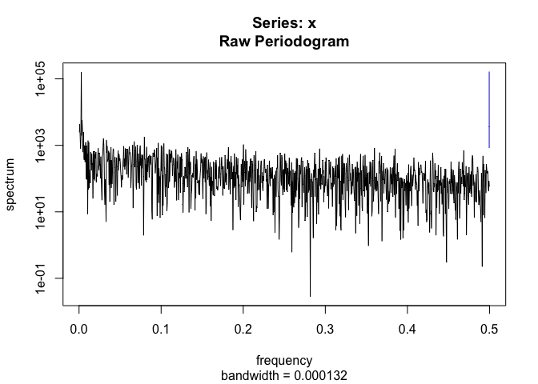
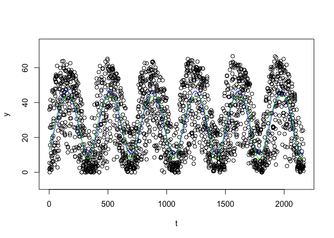
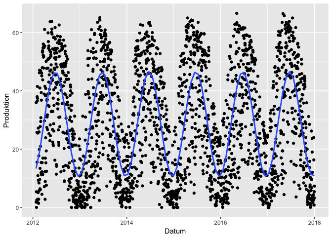
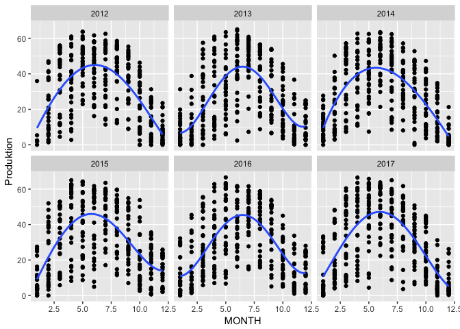
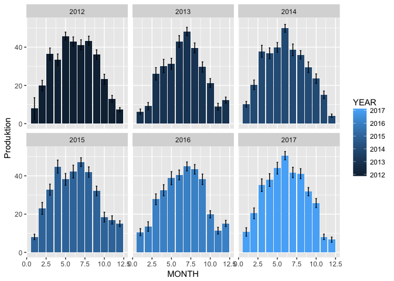
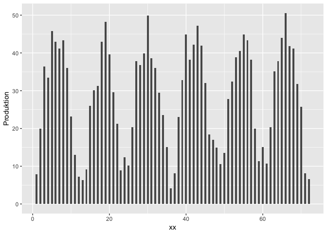

Solar cell data analysis
================

Analysis of solar cell production
=================================

Over the last 6 years I recorded the daily production of out roof mounted solar panels. The panels have a peak production of 10kw/p

Setup
-----

Read data
---------

Data were recorded daily and put in a spreadsheet. For every year a seperate spreadsheet was used. Data were then exported in csv-format, read into R and compined into one tible.

First processing
----------------

### Add standard deviation and mean

``` r
solarcell_tbl_avg <- summarySE(solarcell_tbl, measurevar="Produktion", groupvars=c("YEAR","MONTH"))
```

    ## -------------------------------------------------------------------------

    ## You have loaded plyr after dplyr - this is likely to cause problems.
    ## If you need functions from both plyr and dplyr, please load plyr first, then dplyr:
    ## library(plyr); library(dplyr)

    ## -------------------------------------------------------------------------

    ## 
    ## Attaching package: 'plyr'

    ## The following object is masked from 'package:lubridate':
    ## 
    ##     here

    ## The following objects are masked from 'package:dplyr':
    ## 
    ##     arrange, count, desc, failwith, id, mutate, rename, summarise,
    ##     summarize

``` r
#summary over for months
solarcell_tbl_avg %>% 
  group_by( MONTH) %>% 
  summarise_at(vars(Produktion), funs(mean,sd))
```

    ## # A tibble: 12 x 3
    ##    MONTH      mean       sd
    ##    <dbl>     <dbl>    <dbl>
    ##  1     1  8.952867 1.776104
    ##  2     2 17.708674 5.245644
    ##  3     3 32.649624 4.782019
    ##  4     4 35.907556 5.193481
    ##  5     5 39.661505 5.079778
    ##  6     6 44.836389 4.255614
    ##  7     7 43.629570 3.745462
    ##  8     8 40.901022 2.801784
    ##  9     9 32.858333 3.527798
    ## 10    10 22.024731 2.673192
    ## 11    11 12.215556 3.456142
    ## 12    12 10.085484 4.679254

``` r
#summary over for year
solarcell_tbl_avg %>% 
  group_by(YEAR) %>% 
  summarise_at(vars(Produktion), funs(mean,sd))
```

    ## # A tibble: 6 x 3
    ##    YEAR     mean       sd
    ##   <dbl>    <dbl>    <dbl>
    ## 1  2012 29.19922 14.27541
    ## 2  2013 25.48410 14.12944
    ## 3  2014 28.46245 13.82171
    ## 4  2015 30.05738 13.29536
    ## 5  2016 28.03668 13.28854
    ## 6  2017 29.47583 14.99821

### Add classification

Any daily production exceeding 40 kW is considered a fine day, between 20 and 40 kW middling, and anything below is considered a bad day.

``` r
solarcell_tbl$rating <- sapply(solarcell_tbl$Produktion, wetter)
```

``` r
y <- solarcell_tbl$Produktion
t <- 1:nrow(solarcell_tbl)
x <- solarcell_tbl$Datum


# sinus fit 
#1
ssp <- spectrum(y) 
```



``` r
per <- 1/ssp$freq[ssp$spec==max(ssp$spec)]
reslm <- lm(y ~ sin(2*pi/per*t)+cos(2*pi/per*t))
summary(reslm)
```

    ## 
    ## Call:
    ## lm(formula = y ~ sin(2 * pi/per * t) + cos(2 * pi/per * t))
    ## 
    ## Residuals:
    ##     Min      1Q  Median      3Q     Max 
    ## -42.835 -10.451  -0.814  11.961  31.383 
    ## 
    ## Coefficients:
    ##                     Estimate Std. Error t value Pr(>|t|)    
    ## (Intercept)          28.5809     0.3062   93.34   <2e-16 ***
    ## sin(2 * pi/per * t)   9.2446     0.4312   21.44   <2e-16 ***
    ## cos(2 * pi/per * t) -15.4222     0.4349  -35.46   <2e-16 ***
    ## ---
    ## Signif. codes:  0 '***' 0.001 '**' 0.01 '*' 0.05 '.' 0.1 ' ' 1
    ## 
    ## Residual standard error: 14.25 on 2164 degrees of freedom
    ## Multiple R-squared:  0.4418, Adjusted R-squared:  0.4413 
    ## F-statistic: 856.3 on 2 and 2164 DF,  p-value: < 2.2e-16

``` r
rg <- diff(range(y))
plot(y~t,ylim=c(min(y)-0.1*rg,max(y)+0.1*rg))
lines(fitted(reslm)~t,col=4,lty=1)   # dashed blue line is sin fit

# including 2nd harmonic really improves the fit
reslm2 <- lm(y ~ sin(2*pi/per*t)+cos(2*pi/per*t)+sin(4*pi/per*t)+cos(4*pi/per*t))
summary(reslm2)
```

    ## 
    ## Call:
    ## lm(formula = y ~ sin(2 * pi/per * t) + cos(2 * pi/per * t) + 
    ##     sin(4 * pi/per * t) + cos(4 * pi/per * t))
    ## 
    ## Residuals:
    ##     Min      1Q  Median      3Q     Max 
    ## -40.248  -9.935  -0.776  12.240  28.724 
    ## 
    ## Coefficients:
    ##                     Estimate Std. Error t value Pr(>|t|)    
    ## (Intercept)          28.5667     0.3031  94.264  < 2e-16 ***
    ## sin(2 * pi/per * t)   9.2501     0.4267  21.679  < 2e-16 ***
    ## cos(2 * pi/per * t) -15.4499     0.4305 -35.892  < 2e-16 ***
    ## sin(4 * pi/per * t)   2.8868     0.4271   6.759 1.78e-11 ***
    ## cos(4 * pi/per * t)  -0.6422     0.4301  -1.493    0.136    
    ## ---
    ## Signif. codes:  0 '***' 0.001 '**' 0.01 '*' 0.05 '.' 0.1 ' ' 1
    ## 
    ## Residual standard error: 14.1 on 2162 degrees of freedom
    ## Multiple R-squared:  0.4539, Adjusted R-squared:  0.4529 
    ## F-statistic: 449.2 on 4 and 2162 DF,  p-value: < 2.2e-16

``` r
lines(fitted(reslm2)~t,col=3) 
```



``` r
#2 fft
raw.fft = fft(y)
```

First Plot
----------

### Scatter plot with sinus fit

 \#\#\# Add classification variables for year, month and day

``` r
solarcell_tbl$YEAR <- year(solarcell_tbl$Datum)
solarcell_tbl$MONTH <- month(solarcell_tbl$Datum)
solarcell_tbl$DAY <- day(solarcell_tbl$Datum)
```

### Scatter plot by year

 \#\#\# Monthly averages plot



### Plot months in a row

``` r
xx <-1:nrow(solarcell_tbl_avg)

ggplot(data = solarcell_tbl_avg, aes(x=xx, y = Produktion )) + geom_bar( stat="identity", width = 0.5)
```


